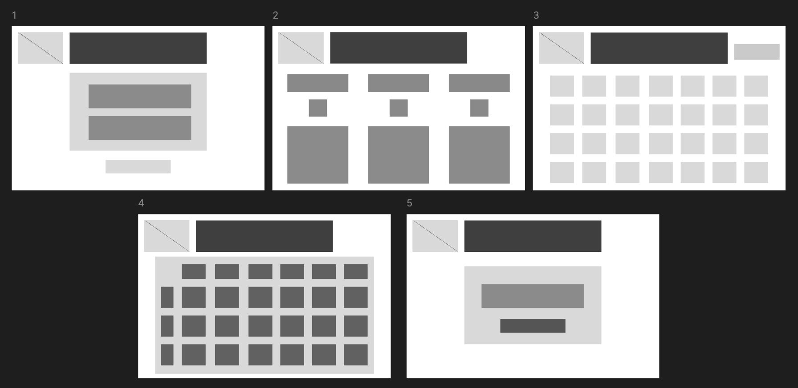
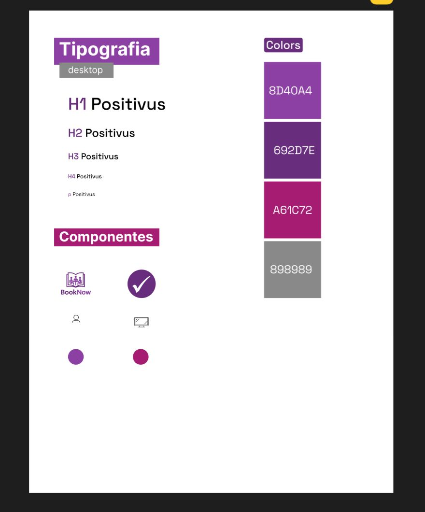
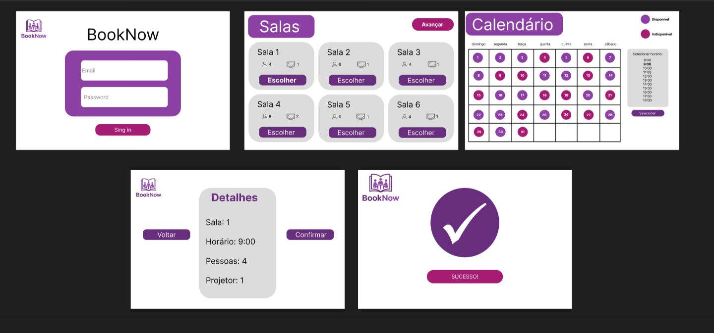

# Web Application Document - Projeto Individual - Módulo 2 - Inteli

## BookNow

#### <a href="http://www.linkedin.com/in/clara-benito">Clara Benito</a>

## Sumário

1. [Introdução](#c1)  
2. [Visão Geral da Aplicação Web](#c2)  
3. [Projeto Técnico da Aplicação Web](#c3)  
4. [Desenvolvimento da Aplicação Web](#c4)  
5. [Referências](#c5)  

<br>

## <a name="c1"></a>1. Introdução 

&emsp; O projeto individual consiste no desenvolvimento de um **Sistema de Reserva de Salas** para ambientes corporativos e educacionais. O objetivo é facilitar o agendamento, gerenciamento e controle de uso de salas, proporcionando mais organização e produtividade para os usuários. O sistema permitirá que colaboradores consultem a disponibilidade, filtrem as salas e realizem reservas de forma simples e eficiente, evitando conflitos de horários e otimizando o uso dos espaços.

---

## <a name="c2"></a>2. Visão Geral da Aplicação Web

### 2.1. Personas 

<div align="center">
  <sub>FIGURA 1 - Personas</sub><br>
  <br>
  <sup>Fonte: Material produzido pela autora, 2025</sup>
</div>

**Idade:** 34 anos 

**Ocupação:** Gerente de Projetos em uma empresa voltada á tecnologia

**Hábitos digitais:**

1. Utiliza diariamente aplicativos de agenda e comunicação (Google Calendar, Slack, Trello)

2. Prefere soluções web/mobile rápidas e intuitivas

3. Costuma acessar sistemas tanto pelo notebook quanto pelo celular

**Necessidades:**

1. Reservar salas para reuniões de equipe e apresentações

2. Visualizar rapidamente a disponibilidade das salas

3. Garantir que não haja conflitos de horários nas reservas

**Dores:**

1. Perda de tempo ao tentar reservar uma sala e descobrir que já está ocupada

2. Falta de transparência sobre quem está usando cada sala e quando

3. Dificuldade em encontrar salas com recursos específicos (projetor, espaço disponível)

**Solução:**

&emsp; O sistema de reserva de salas ajuda Ana a visualizar facilmente a disponibilidade dos espaços, realizar reservas em poucos cliques e filtrar opções conforme suas necessidades (capacidade, equipamentos, horários). Isso elimina conflitos, economiza tempo e melhora a organização das reuniões, tornando o ambiente de trabalho mais eficiente.


### 2.2. User Stories

| ID | Descrição
|------|----------------------------------------------------------------------------------------------------------------------------|
| US01 | Como colaborador, quero visualizar a disponibilidade das salas em um calendário, para escolher o melhor horário.|
| US02 | Como colaborador, quero reservar uma sala informando data, horário e recursos, para garantir espaço adequado.|
| US03 | Como administrador, quero aprovar ou cancelar reservas, para evitar conflitos e gerenciar espaços.|
| US04 | Como colaborador, quero receber notificações por e-mail quando minha reserva for aprovada ou rejeitada, para me manter informado sobre o status da solicitação.|
| US05 | Como colaborador, quero filtrar as salas por capacidade e equipamentos, para encontrar rapidamente uma sala que atenda às necessidades da minha reunião.|

**Análise INVEST da US01**

US01 | Como colaborador, quero visualizar a disponibilidade das salas em um calendário, para que eu possa escolher o melhor horário para minha reunião.

I – Independente:
Esta US pode ser implementada separadamente das outras, pois a visualização do calendário não depende da funcionalidade de reserva ou aprovação.

N – Negociável:
O formato da visualização (calendário semanal, mensal, lista) pode ser discutido e ajustado conforme feedback dos usuários e do time.

V – Valiosa:
Permite ao usuário tomar decisões rápidas e assertivas, reduzindo conflitos e otimizando o uso das salas.

E – Estimável:
O esforço para implementar um calendário de visualização é facilmente estimável pela equipe de desenvolvimento, pois há bibliotecas e padrões prontos para isso.

S – Pequena (Small):
A US é suficientemente pequena para ser desenvolvida em um curto espaço de tempo, sem necessidade de ser dividida.

T – Testável:
É possível testar se o calendário mostra corretamente as disponibilidades, validando com reservas reais e horários bloqueados.

---

## <a name="c3"></a>3. Projeto da Aplicação Web

### 3.1. Modelagem do banco de dados

O sistema possui três entidades principais:
- **users**: usuários do sistema
- **rooms**: salas disponíveis para reserva
- **bookings**: reservas realizadas pelos usuários

O diagrama abaixo ilustra as tabelas e seus relacionamentos:

<div align="center">
  <sub>FIGURA 2 - Diagrama Banco de dados</sub><br>
  <br>
  <sup>Fonte: Material produzido pela autora, 2025</sup>
</div>

### Modelo Físico 

&emsp; O código SQL completo para a criação das tabelas do banco de dados encontra-se no arquivo [`modelo-banco.sql`](./modelo-banco.sql), localizado na raiz do repositório deste projeto.

&emsp; Para consultar a estrutura detalhada das tabelas e seus relacionamentos, acesse diretamente esse arquivo.

https://github.com/clarabenito/Projeto-Individual-1B/blob/main/modelo-banco.sql

**Resumo das entidades e relações:**
- Cada usuário pode realizar várias reservas.
- Cada sala pode ser reservada múltiplas vezes (em horários diferentes).
- Cada reserva está associada a um usuário e a uma sala específica.

### 3.1.1 BD e Models (Semana 5)

O sistema utiliza o Prisma como ORM para interação com o banco de dados PostgreSQL. Os models principais são:

**User Model:**
```prisma
model User {
  id        String    @id @default(uuid())
  nome      String
  email     String    @unique
  criado_em DateTime  @default(now())
  bookings  Booking[]
}
```

**Room Model:**
```prisma
model Room {
  id          String    @id @default(uuid())
  nome        String
  descricao   String?
  capacidade  Int
  status      String    @default("disponivel")
  bookings    Booking[]
}
```

**Booking Model:**
```prisma
model Booking {
  id           String   @id @default(uuid())
  user         User     @relation(fields: [user_id], references: [id])
  user_id      String
  room         Room     @relation(fields: [room_id], references: [id])
  room_id      String
  data_reserva DateTime @default(now())
  data_inicio  DateTime
  data_fim     DateTime
  status       String   @default("confirmada")
}
```

&emsp; Os models foram implementados seguindo as melhores práticas do Prisma, com:
- Relacionamentos adequados entre as entidades
- Tipos de dados apropriados para cada campo
- Valores padrão quando necessário
- Constraints de unicidade e chaves estrangeiras

### 3.2. Arquitetura (Semana 5)

&emsp; O sistema segue a arquitetura MVC (Model-View-Controller) com Node.js e Express.js, utilizando PostgreSQL como sistema gerenciador de banco de dados e Prisma como ORM.

&emsp; A separação de responsabilidades entre as camadas facilita a manutenção e a escalabilidade da aplicação:
- **Model**: armazena o modelo de negócios da aplicação, utilizando Prisma para interação com o banco
- **View**: parte visual da aplicação (EJS)
- **Controller**: intermediário entre Model e View
- **Services**: camada adicional para lógica de negócios complexa
- **Routes**: gerenciamento de rotas da aplicação

### 3.3. Wireframes (Semana 03)

&emsp; Os wireframes abaixo representam as principais telas da aplicação web **BookNow**, desenvolvida para facilitar a reserva de salas em ambientes corporativos e educacionais. A proposta é oferecer uma interface simples, intuitiva e funcional para os usuários realizarem reservas com rapidez e clareza.

&emsp; As telas foram desenhadas considerando os fluxos principais identificados nas User Stories:

**Tela 1 – Login**  
&emsp; Acesso ao sistema com campos para e-mail e senha,tro de novo usuário.

**Tela 2 – Salas e características**  
&emsp; Exibe todas as salas e seus atributos.

**Tela 3 – Calendário Geral de Reservas**   
&emsp; Visualização mensal com indicação de dias disponíveis e indisponíveis para reserva.

**Tela 4 – Seleção de Dia e Horário por Sala**  
&emsp; Exibição detalhada da disponibilidade por sala e horário no dia selecionado, permitindo ao usuário escolher o melhor período para a reserva. 

**Tela 5 - Confirmação de Reserva**
&emsp; Tela final de agendamento, onde o usuário revisa os dados (sala, data, horário) e confirma a reserva. É possível adicionar uma descrição da reunião ou marcar participantes (não obrigatórios).

<div align="center">
  <sub>FIGURA 3 - Wireframe</sub><br>
  <br>
  <sup>Fonte: Material produzido pela autora, 2025</sup>
</div>

### 3.4. Guia de estilos (Semana 05)

&emsp; O sistema utiliza uma identidade visual consistente baseada em tons de roxo e cinza:

**Cores:**
- Roxo Principal: #8D40A4
- Roxo Secundário: #B366C9
- Cinza Escuro: #333333
- Cinza Claro: #F5F5F5
- Branco: #FFFFFF


**Tipografia:**
- Família: Roboto
- Hierarquia:
  - H1: Roboto (títulos principais)
  - H2: Roboto (subtítulos)
  - H3: Roboto (seções)
  - H4: Roboto (subseções)
  - p: Roboto (corpo do texto)

  **Componentes:**
  - Logo: Ícone de livro estilizado com "BookNow"
- Botões:
  - Primário: Fundo roxo (#8D40A4) com texto branco
  - Secundário: Fundo rosa (#A61C72) com texto branco
  - Terciário: Fundo cinza com texto escuro
- Cards: Cantos arredondados com fundo cinza claro
- Ícones:
  - Check mark para confirmações
  - Usuário para indicadores de capacidade
  - Monitor para indicadores de equipamentos

<div align="center">
  <sub>FIGURA 4 - Guia de Estilos</sub><br>
  <br>
  <sup>Fonte: Material produzido pela autora, 2025</sup>
</div>
---

### 3.5. Protótipo de alta fidelidade (Semana 05)

&emsp; O protótipo foi desenvolvido seguindo o guia de estilos e inclui as seguintes telas principais:

**1. Tela de Login**
- Logo BookNow no topo
- Campos para email e senha
- Botão "Entrar" em destaque

**2. Lista de Salas**
- Exibição em grid das salas
- Cada sala mostra:
  - Número da sala
  - Capacidade (ícone de pessoa)
  - Equipamentos (ícone de monitor)
- Botão "Escolher" para cada sala
- Botão "Avançar" no topo direito

**3. Calendário de Reservas**
- Visualização mensal completa
- Legenda de disponibilidade:
  - Verde: Disponível
  - Vermelho: Indisponível
- Seletor de horários na lateral direita
- Indicadores visuais claros de status

**4. Detalhes da Reserva**
- Card com informações da sala selecionada:
  - Número da sala
  - Horário escolhido
  - Capacidade
  - Equipamentos disponíveis
- Botões de "Voltar" e "Confirmar"

**5. Confirmação**
- Ícone de check grande
- Mensagem de "SUCESSO!"
- Design minimalista focado na confirmação

<div align="center">
  <sub>FIGURA 5 - Protótipo de Alta Fidelidade</sub><br>
  <br>
  <sup>Fonte: Material produzido pela autora, 2025</sup>
</div>
---

### 3.6. WebAPI e endpoints (Semana 05)

A API do BookNow segue o padrão REST e está documentada detalhadamente em: [Documentação da API](./api-docs.md)

**Endpoints Principais:**

1. **Autenticação**
   - `POST /api/auth/login` - Login de usuário
   - `POST /api/auth/register` - Registro de novo usuário
   - `POST /api/auth/logout` - Logout de usuário

2. **Usuários**
   - `GET /api/users` - Lista todos os usuários (admin)
   - `GET /api/users/:id` - Obtém dados de um usuário
   - `PUT /api/users/:id` - Atualiza dados do usuário
   - `DELETE /api/users/:id` - Remove usuário (admin)

3. **Salas**
   - `GET /api/rooms` - Lista todas as salas
   - `GET /api/rooms/:id` - Obtém detalhes de uma sala
   - `POST /api/rooms` - Cria nova sala (admin)
   - `PUT /api/rooms/:id` - Atualiza dados da sala (admin)
   - `DELETE /api/rooms/:id` - Remove sala (admin)

4. **Reservas**
   - `GET /api/bookings` - Lista reservas do usuário
   - `GET /api/bookings/:id` - Obtém detalhes de uma reserva
   - `POST /api/bookings` - Cria nova reserva
   - `PUT /api/bookings/:id` - Atualiza reserva
   - `DELETE /api/bookings/:id` - Cancela reserva

5. **Calendário**
   - `GET /api/calendar` - Obtém disponibilidade das salas
   - `GET /api/calendar/room/:id` - Obtém agenda de uma sala
   - `GET /api/calendar/user/:id` - Obtém agenda de um usuário

&emsp; Cada endpoint retorna respostas no formato JSON e utiliza códigos HTTP apropriados para indicar o sucesso ou falha das operações.

---

### 3.7 Interface e Navegação (Semana 07)

*Descreva e ilustre aqui o desenvolvimento do frontend do sistema web, explicando brevemente o que foi entregue em termos de código e sistema. Utilize prints de tela para ilustrar.*

---

## <a name="c4"></a>4. Desenvolvimento da Aplicação Web (Semana 8)

### 4.1 Demonstração do Sistema Web (Semana 8)

*VIDEO: Insira o link do vídeo demonstrativo nesta seção*
*Descreva e ilustre aqui o desenvolvimento do sistema web completo, explicando brevemente o que foi entregue em termos de código e sistema. Utilize prints de tela para ilustrar.*

### 4.2 Conclusões e Trabalhos Futuros (Semana 8)

*Indique pontos fortes e pontos a melhorar de maneira geral.*
*Relacione também quaisquer outras ideias que você tenha para melhorias futuras.*


## <a name="c5"></a>5. Referências

_Incluir as principais referências de seu projeto, para que seu parceiro possa consultar caso ele se interessar em aprofundar. Um exemplo de referência de livro e de site:_<br>

---
---
