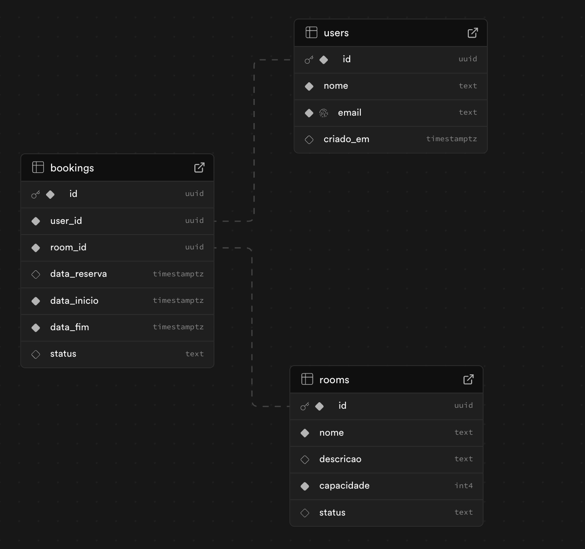

**Desenvolvido por [Clara Benito](http://www.linkedin.com/in/clara-benito)**

# BookNow – Sistema de Reservas Online

Sistema web para gerenciamento de reservas de salas, desenvolvido em Node.js com Express, EJS e Supabase, seguindo o padrão MVC.

## Descrição do Sistema

O BookNow permite que usuários consultem a disponibilidade de salas, filtrem por capacidade ou recursos e realizem reservas de forma simples e eficiente, evitando conflitos de horários e otimizando o uso dos espaços.

## Estrutura de Pastas e Arquivos
Projeto-Individual-1B/

## Como Executar o Projeto 

1. Abra o terminal na pasta do projeto.
2. Execute o arquivo `server.js` usando Node.js.
3. Acesse `http://localhost:3000` no navegador para visualizar o sistema. 

## Modelo do Banco de Dados

- O diagrama do banco de dados está em:  
  

- O código SQL para criação das tabelas está em [`modelo-banco.sql`](./modelo-banco.sql).

